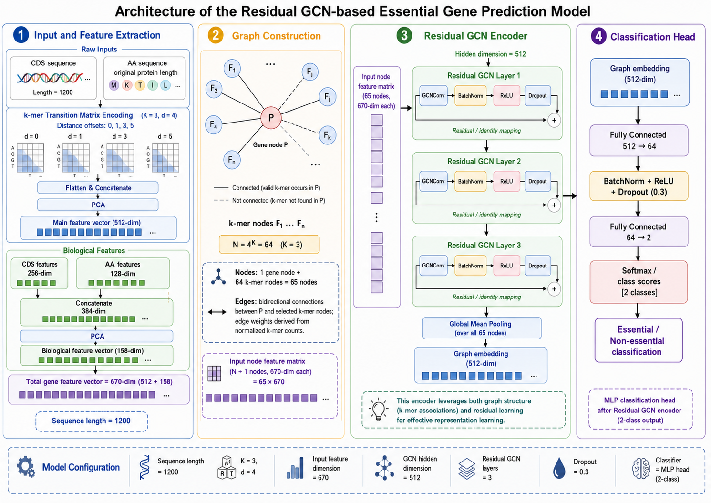

# Residual GCN for Plant Essential Gene Prediction

This repository contains a modular implementation of a residual graph convolutional network for plant essential gene prediction.

The model uses CDS sequences, amino acid sequences, k-mer transition matrix encoding, PCA-reduced biological features, a star-like gene-k-mer graph, residual GCN layers, global mean pooling, and an MLP classification head for binary prediction.



## Project structure

```text
plant-essential-gene-residual-gcn/
|-- train.py
|-- requirements.txt
|-- .gitignore
|-- docs/
|   `-- model_architecture.png
|-- data/
|   `-- arabidopsis/
|       `-- README.md
`-- plant_essential_gcn/
    |-- config.py
    |-- data.py
    |-- deployment.py
    |-- features.py
    |-- graph.py
    |-- losses.py
    |-- metrics.py
    |-- model.py
    `-- train_utils.py
```

## Data preparation

Put the FASTA files into `data/arabidopsis/` with these names:

```text
cds_essential_train.fasta
cds_essential_test.fasta
cds_nonessential_train.fasta
cds_nonessential_test.fasta
aa_essential_train.fasta
aa_essential_test.fasta
aa_nonessential_train.fasta
aa_nonessential_test.fasta
```

You can also set environment variables:

```bash
export PLANT_GCN_DATA_DIR=/path/to/arabidopsis_fasta
export PLANT_GCN_OUTPUT_DIR=/path/to/output
python train.py
```

Windows PowerShell example:

```powershell
$env:PLANT_GCN_DATA_DIR="D:\datasets\arabidopsis"
$env:PLANT_GCN_OUTPUT_DIR="D:\outputs\plant_gcn"
python train.py
```

## Installation

```bash
python -m venv .venv
pip install -r requirements.txt
```

Install the PyTorch and PyTorch Geometric builds that match your CUDA environment when GPU acceleration is required.


## Current training parameters

```text
MAX_EPOCHS = 200
POS_WEIGHT_CAP = 3.0
FOCAL_ALPHA = 0.20
FOCAL_GAMMA = 2.0
EARLY_STOP_PATIENCE = 30
```

## Run training

```bash
python train.py
```

The model selection rule is:

1. Before `Youden_J` reaches `1.0`, save the model when `Youden_J` improves.
2. After `Youden_J == 1.0`, save a new model only when `Youden_J` remains `1.0` and `train_loss` decreases.
3. Stop training after `EARLY_STOP_PATIENCE` epochs without a valid improvement.
4. Evaluate the saved best model on the predefined test set.

## Upload to GitHub

```bash
git init
git add .
git commit -m "Initial release: residual GCN essential gene prediction"
git branch -M main
git remote add origin https://github.com/YOUR_USERNAME/YOUR_REPOSITORY.git
git push -u origin main
```

The `.gitignore` excludes FASTA files, output folders, model weights, reducers, and report files.
